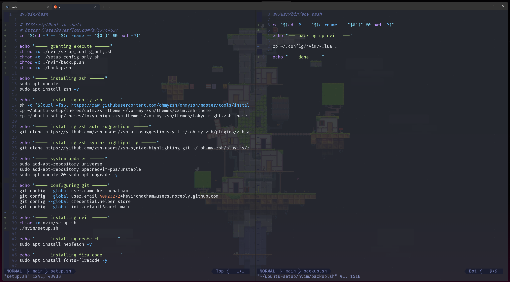

# Ubuntu Setup 

This repository automates the setup of my Ubuntu Server / WSL dev environment on using Zsh. It installs all necessary dependencies and software packages, including Zsh plugins and command-line tools like Git, Nvim config and theme, NVM, PowerShell, .NET, Fira Code, Zsh config and theme, Terraform, AZ CLI, etc. 

There are scripts for backing up and restoring configuration files, allowing for east migration of development environment when configuring a new system.

## Quick Start

1. Clone and run `setup.sh`

    ```bash
    sudo apt install git -y && git clone https://github.com/kevinchatham/setup.sh ~
    chmod +x ~/setup.sh/setup.sh
    sh ~/setup.sh/setup.sh
    ```

    - Enter default input / password when prompted.

    - You will be prompted to configure `zsh`. Use the default options / `y` and `exit` when dropped into the new shell. Everything should continue normally after that.

## Aliases

```bash
# list hidden
alias lh="ls -a"

# comfort
alias powershell="pwsh"

# shorthand clear / exit
alias c="clear"
alias cls="clear"
alias e="exit"

# one word git actions
alias add="git add ."
alias commit=commit_function
alias dif="git diff --color-words"
alias status="git status"

# one word os update / upgrade
alias update="sudo apt update"
alias upgrade="sudo apt update && sudo apt upgrade -y"

# nvim only
alias v="nvim"
alias vi="nvim"
alias vim="nvim"
alias nvim-config="nvim ~/.config/nvim/init.lua"

# zsh config, colors, and themes
alias zsh-config="nvim ~/.zshrc"
alias zsh-spectrum="spectrum_ls"
alias zsh-themes="nvim ~/.oh-my-zsh"
```

## Neovim Screenshot



## ZSH Screenshot


## WSL

### Resetting Ubuntu

Ubuntu can be reset with one of these commands.

- WSLv2:

    ```batch
    wsl --unregister Ubuntu && ubuntu
    ```

- WSLv1:

    ```batch
    wslconfig /unregister Ubuntu && ubuntu
    ```

### Install Ubuntu Without Microsoft Store

If you do not have access to the Microsoft Store, don't worry, Ubuntu can be manually installed. Please see [this documentation](https://docs.microsoft.com/en-us/windows/wsl/install-manual) (at Downloading Distributions) for more details. Note that you will need to [install WSL](https://docs.microsoft.com/en-us/windows/wsl/install) first.
