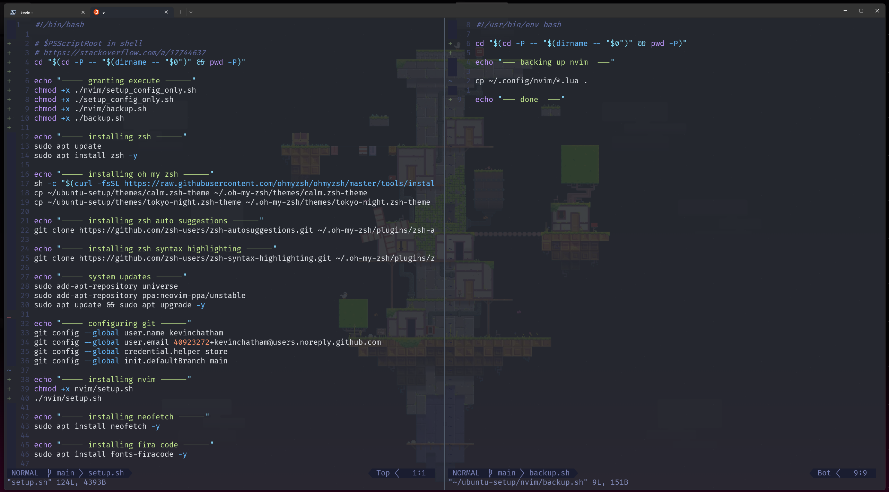
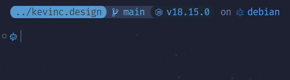

# Development Environment Setup

This project automates the setup and maintenance of a consistent development environment on Debian-based Linux systems (Debian, Ubuntu). It uses a main script that is idempotent, meaning it can be run safely multiple times to install or update all the necessary tools and configurations.

## Features

This setup script will install and configure the following:

- **System & Shell:**
  - Core dependencies via `apt`.
  - **Zsh** with **Oh My Zsh** for a powerful shell experience.
  - **Starship Prompt:** A minimal, blazing-fast, and infinitely customizable prompt.
  - **Zsh Plugins:** `zsh-autosuggestions` and `zsh-syntax-highlighting`.
  - **OpenSSH Server:** Installed and enabled automatically if the script is *not* running in a WSL environment.
- **Development Tools:**
  - **Git:** Including basic user configuration.
  - **.NET SDK (v9):** Installed via the recommended method for your OS.
  - **PowerShell:** Installed as a cross-platform .NET global tool.
  - **Terraform:** The latest version is automatically detected and installed.
- **Node.js Environment:**
  - **NVM (Node Version Manager):** To manage multiple Node.js versions.
  - **Node.js:** The latest Long-Term Support (LTS) version.
  - **npm:** The latest version.
- **Command-Line Utilities:**
  - **Azure CLI:** For managing Azure resources.
  - `htop` for process monitoring.
  - `neofetch` for system information.
  - `sqlite3` for database management.
- **Configuration:**
  - Automatically trusts the `.NET` local development certificate (`dev-certs`).
  - Sets up configuration files for `nvim`, `starship`, `.bashrc`, and `.zshrc`.

---

## Quick Start (One-Liner)

For a fresh Debian-based system, you can use the following command to ensure `curl` is installed and then execute the setup script in a single line.

```bash
sudo apt update && sudo apt install -y curl && bash <(curl -sL https://kevinc.design/launch.sh)
```
You will be prompted for your password to authorize system-wide changes.

## Usage

### 1. Main Setup (Linux/WSL)

The main `setup.sh` script installs and updates all the tools listed above.

**First-time setup:**
```bash
# Make the script executable
chmod +x setup.sh

# Run the script
./setup.sh
```

**Updating:**

Because the script is idempotent, you can re-run it at any time to update the tools to their latest versions.
```bash
./setup.sh
```
For convenience, the `.zshrc` profile configured by this setup includes a custom `upgrade` alias. This single command will update all system packages via `apt` and then run `setup.sh` to update all other tools in one step.

```bash
# A convenient alias to update everything
upgrade
```

### 2. Configuration Management

This repository is designed to manage your personal configuration files.

-   **`scripts/setup-config.sh`**: This script copies the configuration files (e.g., `.zshrc`, `nvim/init.lua`) from this repository to your local home directory. The main `setup.sh` script runs this automatically.
-   **`scripts/backup-config.sh`**: After you've made changes to your local configuration files, run this script to copy them back into this repository, allowing you to commit your changes to version control.

```bash
# To back up your local configs to the repo
./scripts/backup-config.sh
```

### 3. Windows Hyper-V Setup (Alternative to WSL)

For Windows users who prefer a traditional virtual machine over WSL, the `scripts/setup-hyper-v.ps1` PowerShell script provides a convenient way to create a Debian VM. Once created, you can run the main `setup.sh` script inside it.

**To use it:**
1.  Open a **PowerShell** terminal with **Administrator privileges**.
2.  Navigate to the `scripts` directory.
3.  Run the script and follow the prompts.

```powershell
# From an administrative PowerShell terminal
cd ./scripts
./setup-hyper-v.ps1
```
The script will guide you through downloading the Debian ISO and creating the virtual machine.

## Aliases

```bash
# list hidden
alias lh="ls -a"

# comfort
alias powershell="pwsh"

# shorthand clear / exit
alias c="clear"
alias cls="clear"
alias e="exit"

# one word git actions
alias add="git add ."
alias commit=commit_function
alias dif="git diff --color-words"
alias status="git status"

# one word os update / upgrade
alias update="sudo apt update"
alias upgrade="sudo apt update && sudo apt upgrade -y"

# nvim only
alias v="nvim"
alias vi="nvim"
alias vim="nvim"
alias nvim-config="nvim ~/.config/nvim/init.lua"

# zsh config, colors, and themes
alias zsh-config="nvim ~/.zshrc"
alias zsh-spectrum="spectrum_ls"
alias zsh-themes="nvim ~/.oh-my-zsh"
```

## Neovim Screenshot



## Shell Theme (starship.toml)

